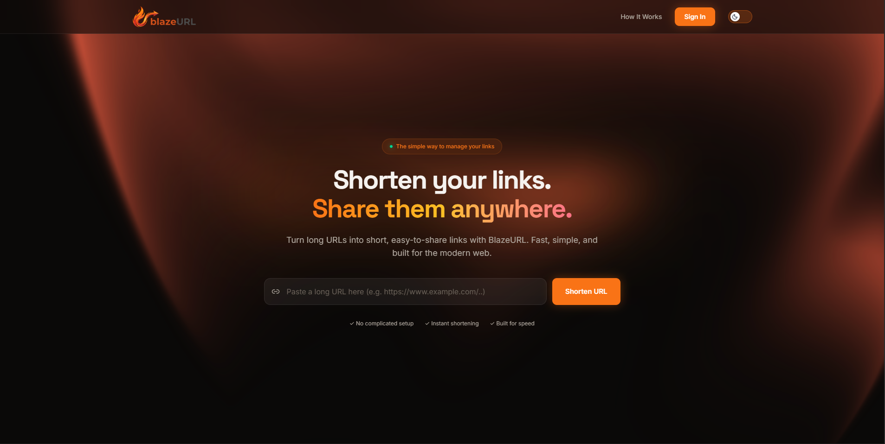

  

# 🔥 BlazeURL — Blazing Fast URL Shortener

---

---

## 📖 About

**BlazeURL** is a fast, minimal, and clean URL shortener web application. It converts long, clunky URLs into short, shareable links in seconds.

BlazeURL supports both **anonymous URL shortening** and **Google-authenticated users** with additional link management and analytics features.

---

## ⚡ Built With

---

## ✨ Features

<table>
<tr>
<td width="50%">

### 🔗 URL Shortening

- ⚡ Instant short link generation
- 📋 One-click copy to clipboard
- 🔒 URL validation before shortening
- 🌐 Anonymous URL shortening
- ⏳ Automatic expiry for temporary URLs

</td>

<td width="50%">

### 👤 User Accounts

- 🔐 Google authentication
- 📊 Personal dashboard
- 🔗 Manage your shortened URLs
- ⏱️ Custom URL expiry
- 🗑️ Delete URLs anytime

</td>
</tr>

<tr>
<td width="50%">

### 📈 Link Analytics

- 🖱️ Track link clicks
- 📊 View click status from your dashboard
- ⚡ Fast redirect handling
- 🔄 Real-time link status

</td>

<td width="50%">

### 🛠️ Additional Features

- 📱 QR code generation
- ⏰ Automatic expired-link cleanup
- 🚀 Redis caching
- 🎨 Responsive modern UI
- 🌙 Light & dark mode
- 🔥 Clean glassmorphism-inspired interface

</td>
</tr>
</table>

---

## 🔗 URL Expiry

BlazeURL handles URL expiration automatically.

- 👤 **Anonymous URLs** expire automatically after **48 hours**
- 🔐 **Authenticated users** can configure their own URL expiry
- 🧹 Expired URLs are automatically removed from the database
- ⚡ Expired cached URLs are also cleaned up

---

## 📬 Contact

---

### ⭐ Show Your Support

If you found this project useful, consider giving it a star — it helps a lot!

---
